# Support Inbox - Process Flows

This document maps out all major process flows in the system using Mermaid diagrams.

---

## 1. Incoming Email Processing (Email Daemon)

The email daemon polls the IMAP inbox on a configurable interval and processes each unseen email.

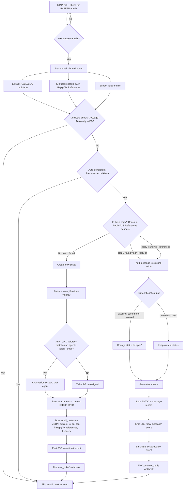

---

## 2. Agent Replies to a Ticket

When an agent sends a reply from the UI via `POST /tickets/:id/reply`.

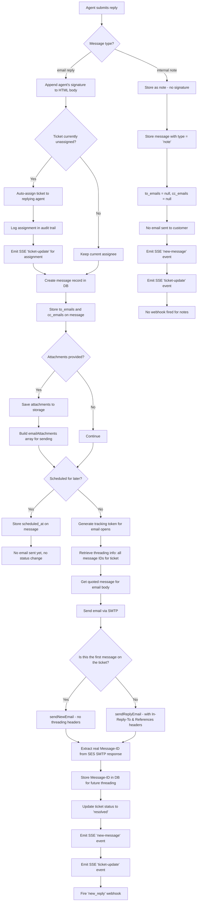

---

## 3. Ticket Creation via API

When a ticket is created manually via `POST /tickets` (e.g., from automation or the UI).

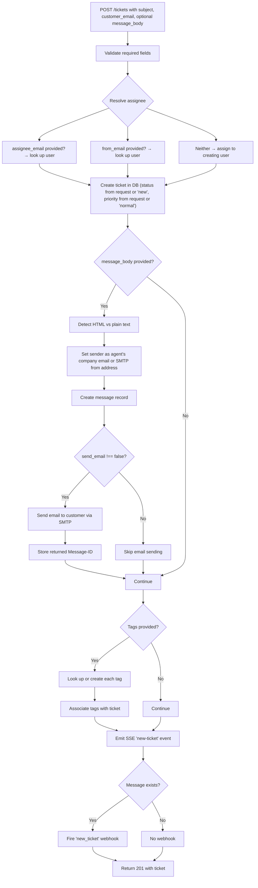

---

## 4. Ticket Update Flow

When a ticket's metadata is changed via `PATCH /tickets/:id`.

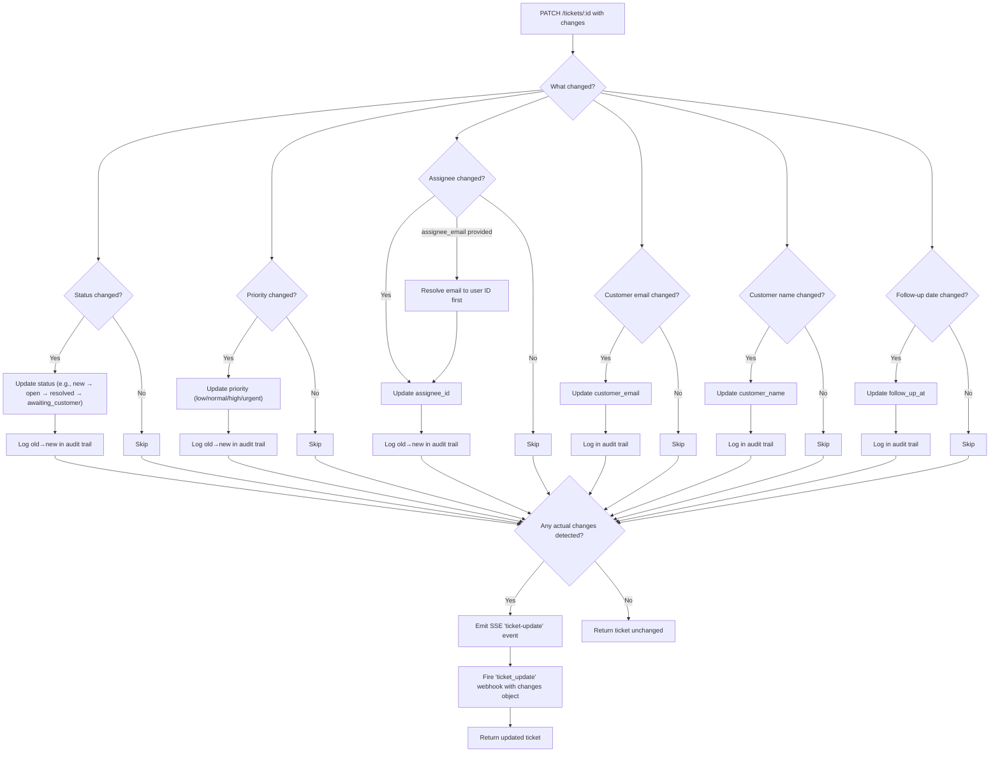

---

## 5. Scheduled Message Flow

When an agent schedules a reply to be sent later.

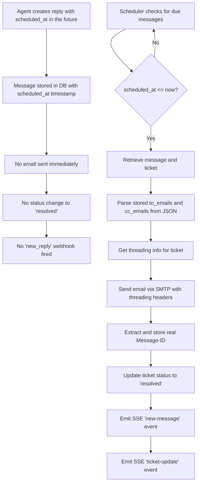

---

## 6. Email Threading Model

How email threading headers are managed to keep conversations organized.

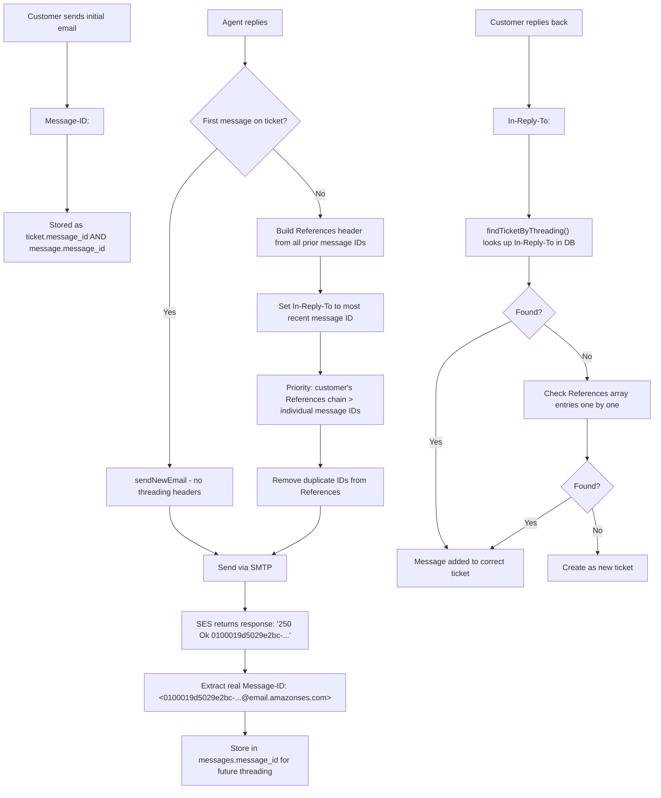

---

## 7. Multiple Recipients (TO/CC) Handling

How TO and CC recipients flow through the system.

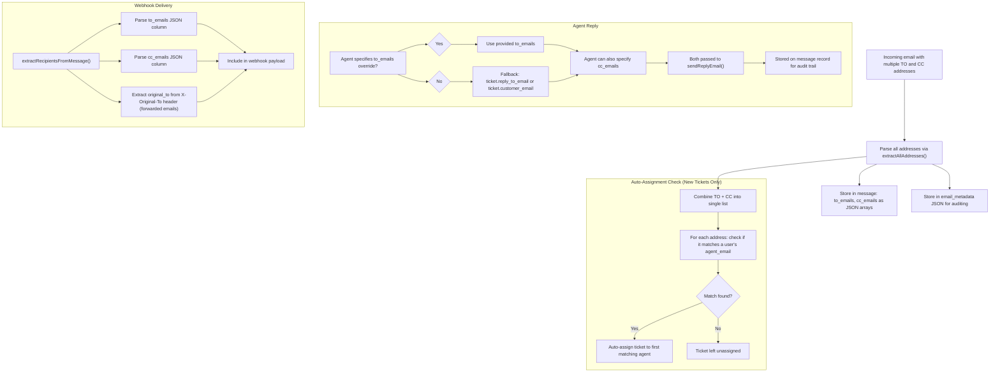

---

## 8. Webhook Event Lifecycle

All webhook events and when they fire.

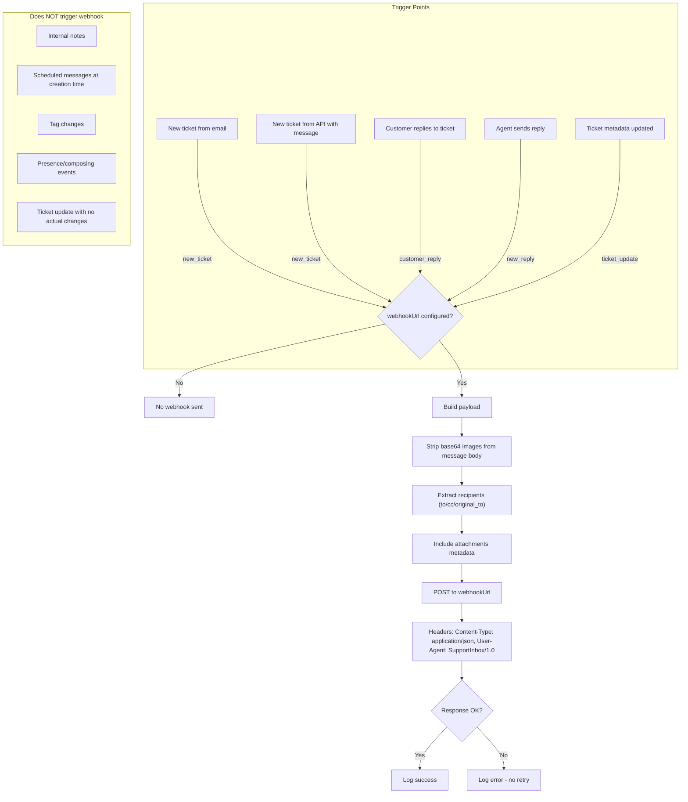

---

## 9. SSE (Real-Time) Event Lifecycle

All Server-Sent Events and when they are broadcast.

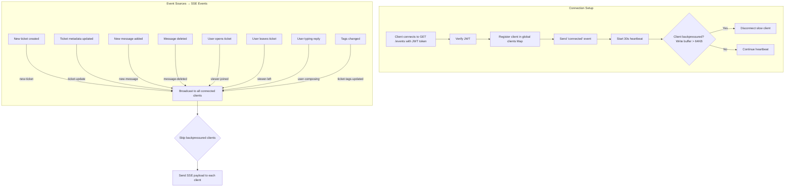

---

## 10. Complete Ticket Lifecycle (Status Transitions)

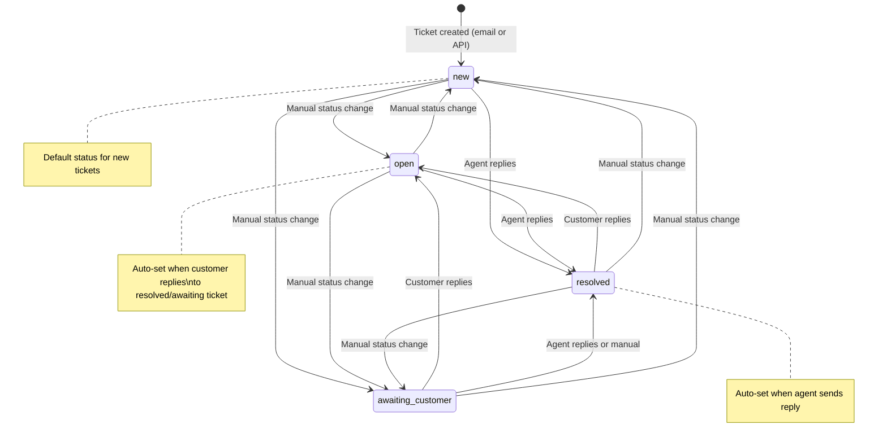

---

## 11. Attachment Handling Flow

```mermaid
flowchart TD
    subgraph "Incoming Email Attachments"
        A[Email parsed with attachments] --> B{File is HEIC/HEIF?}
        B -- Yes --> C[Convert to JPEG via heic-convert]
        B -- No --> D[Keep original format]
        C & D --> E["Save to storage (S3 or local filesystem)"]
        E --> F[Store metadata in attachments table: filename, path, size, contentType]
    end

    subgraph "Agent Reply Attachments"
        G[Agent uploads files with reply] --> H[Save to storage]
        H --> I[Create attachment records in DB]
        I --> J{Storage type?}
        J -- S3 --> K[Read as buffer for email attachment]
        J -- Local --> L[Use file path for email attachment]
        K & L --> M[Attach to outgoing email via nodemailer]
    end

    subgraph "Attachment in Events"
        N[Attachments included in SSE 'new-message' payload]
        O[Attachments metadata included in webhook payloads]
    end
```

---

## 12. Internal Notes Flow

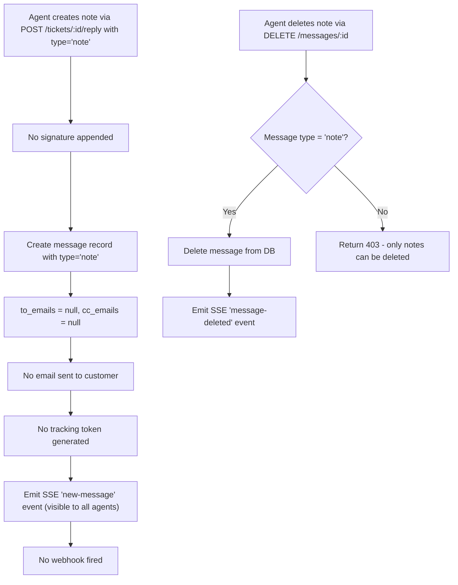

---

## 13. From Address Priority

How the sender address is determined for outgoing emails.

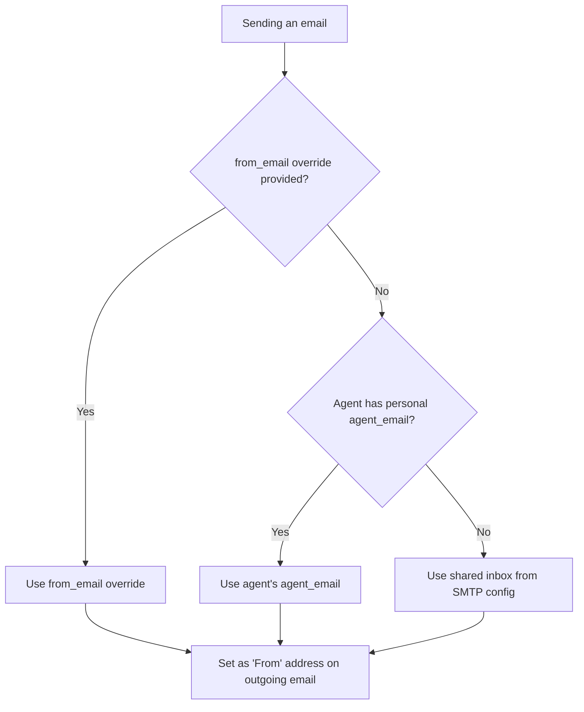

---

## 14. Bulk Update Flow

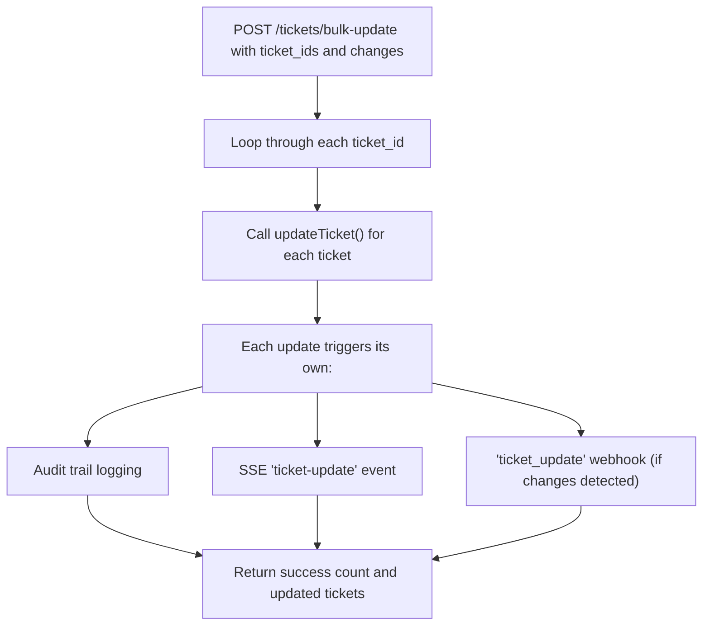
